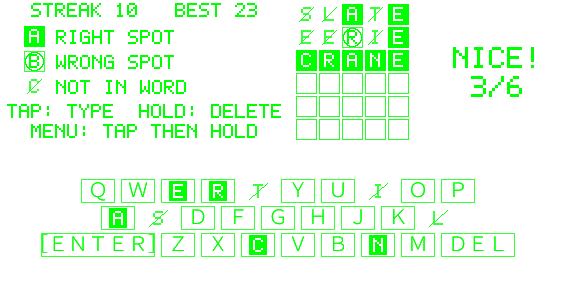

# WordLens

Endless 5-letter word guessing for Even Realities G2 glasses, built as an Even Hub plugin.
Six guesses per word, a streak and guess distribution that survive a full app restart, and the next word is dealt the moment a round ends.



## Quick start

```bash
npm install
npm test               # 68 unit + play-through tests
npm run dev            # Vite on :5173
npm run simulate       # in a second terminal: evenhub-simulator against :5173
npm run qr             # QR code to sideload the dev server onto your phone
npm run pack           # production build → wordlens.ehpk
npx tsx scripts/listing-sim.ts    # store play screenshots from the simulator (keyboard text)
npx tsx scripts/listing-shots.ts  # store Help and Stats screenshots
```

Requires Even App ≥ 2.2.10 and SDK ≥ 0.0.15 (pinned in `package.json` / `app.json`).
Older SDKs drop long-press event types and misread a long press as two taps.

## Settings

Edit `DEFAULT_SETTINGS` in `src/config.ts`:

| Setting | Options | Default | What it does |
| --- | --- | --- | --- |
| `boardSide` | `'right'` / `'left'` | `'right'` | Side of the guess board. Right keeps it visible while the OS menu (which opens over the left) is showing. |
| `letterOrder` | `'frequency'` / `'alphabetical'` | `'frequency'` | Letter order in the picker. |
| `picker` | `'keyboard'` / `'vertical'` / `'horizontal'` | `'keyboard'` | Keyboard = QWERTY with ENTER and DEL, letters as firmware text over drawn key frames; a swipe moves the focus with a text update (~60 ms), no image send, and the keys show the letter marks. Vertical = the native list (firmware-drawn, 20-item limit, so letters span two pages). Horizontal = a drawn carousel with all 28 items on one wrapping strip. |

For quick testing without editing code, URL parameters override the defaults:
`http://localhost:5173/?picker=horizontal&order=alphabetical&board=left`

## How to play

With the keyboard (default): swipe to walk the keys (Q → P, A → L, ENTER, Z → M, DEL, then around again);
brackets mark the key you are on. Tap types it; tap ENTER to guess. Hold deletes, tap-then-hold opens the menu,
double-tap exits. The keys carry the same marks as the board. The two pickers below are still available.

| Gesture | Vertical picker | Horizontal picker | Help / Stats |
| --- | --- | --- | --- |
| Swipe up/down | Move through the list (edges do not wrap) | Move left/right along the carousel (wraps) | – |
| Tap | Type the highlighted item | Type the centred item | Back to Play |
| Hold | Delete one letter | Delete one letter | – |
| Double-tap | Exit prompt | Exit prompt | Exit prompt |
| Tap, then hold | Menu: Enter guess, Backspace, Help, Stats, Give up, Quit | Same | Back to game, Quit |

Items: `DEL` backspaces, `ENTER` submits. In the vertical picker, page A holds `DEL`, `ENTER`, 17 letters and
`MORE >>` (the 20-item limit); page B holds the other 9 letters and `<< BACK`. Scrolling past either
edge does not change pages.
Double letters (APPLE) need two separate taps. A fast double-tap is a double-tap, not two single taps.

Marks use shape, not brightness alone: solid fill = right spot, circle = wrong spot, strike = not in word.
Dim marks (absent letters, empty cells) stay visible.

**Stats** shows streak, best, played, wins and win rate, plus a bar chart of guesses per game
(1–6, and L for losses and give-ups). Wins are solid bars, L is an outline, and your latest game's bar is full brightness.

## Layout

Keyboard picker (default):

```
+---------------------------+---------------------------+
| STREAK n   BEST n         | board 6×5 | message strip |   two 288×144 images
| marks legend, gestures    |           |               |
+---------------------------+---------------------------+
| key frames + marks: two 288×144 images                |
| keyboard text (fullwidth, 20 px cells, 27 px lines)   |   text box on top, not the capture
| blank text container underneath: isEventCapture: 1    |
+-------------------------------------------------------+
```

Fullwidth characters are monospaced in the G2 font, so the text is a grid and the frames are drawn on it (see
`src/textkb.ts`). Letters in the right spot or not in the word are drawn by the image (dark on a fill, or dim
with a strike) and blanked in the text, since text has one brightness.

List and carousel pickers:

```
+---------------------------+---------------------------+
| STREAK n   BEST n         | board 6×5 | message strip |   two 288×144 images
| QWERTY status (display)   |           |               |
+---------------------------+---------------------------+
| vertical: native list, 576×144, isEventCapture: 1     |
| horizontal: 288×64 carousel image over a blank        |
|             text container that catches swipes        |
+-------------------------------------------------------+
```

## Code map

| File | Role |
| --- | --- |
| `src/config.ts` | Settings, list pages, carousel items, menu IDs, timings. |
| `src/game.ts` | Scoring (duplicate-letter rules), key marks, stats and distribution rules. Pure. |
| `src/deck.ts` | Seeded Fisher–Yates deck; only seed + index are persisted. |
| `src/words/` | Packed answer list (2,069) and allowlist (8,679). Generated. |
| `src/storage.ts` | Typed, defensive `get/setLocalStorage` wrapper. |
| `src/input.ts` | Raw events → inputs. Handles missing `eventType` / index per envelope. |
| `src/imageQueue.ts` | The only caller of `updateImageRawData` and `textContainerUpgrade`. Serial, coalescing, rebuild-aware; text updates jump ahead of waiting images. |
| `src/textkb.ts` | The text keyboard: key grid, keyboard text with ［ ］ focus, key frames and marks. Pure. |
| `src/render/` | 4-bit framebuffer, 5×7 pixel font, board / keys / info / help / chart / carousel renderers, PNG encoder. |
| `src/pages.ts` | Container layouts and menus for Play (both pickers), Help, Stats. |
| `src/controller.ts` | State machine: rounds, pages, pickers, persistence, drawing. Host is injected. |
| `src/main.ts` | SDK bridge wiring, URL setting overrides, phone page that mirrors the glasses frames. |

Grey levels per mark are in `src/render/cells.ts` (`LEVELS`).
`npm run preview-frames` renders sample frames to `previews/` without any device.
`npm run wordlists` regenerates the word lists (see `LICENSES.md`).

## Verified in evenhub-simulator 0.9.5

Both pickers, both board sides, typing, submit and scoring, the `MORE >>` page swap, the contextual
menu (Enter, Give up, Stats, Help), the Stats page and chart, double-tap exit, persistence across a
WebView reload, and recovery when `createStartUpPageContainer` fails on reload.
Screenshots are in `docs/screenshots/`.

Observed on the wire: list taps arrive as `listEvent` with only `currentSelectItemIndex`; swipes on a
native list emit no events; swipes on a text container emit `SCROLL_BOTTOM` (down) / `SCROLL_TOP` (up)
as `textEvent`; taps on a text container arrive as `sysEvent`; double-tap arrives as `sysEvent` type 3.
